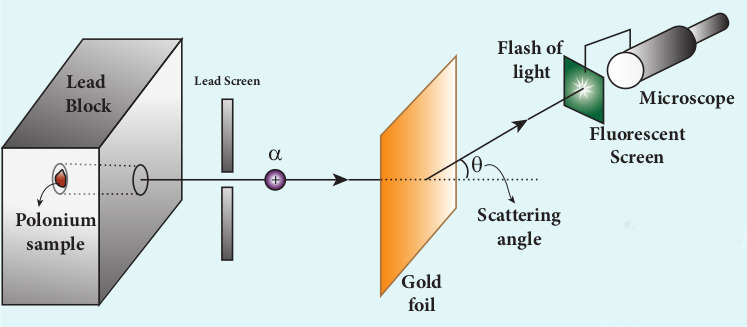
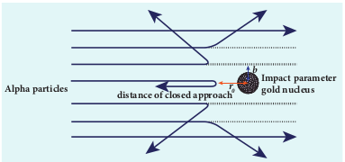
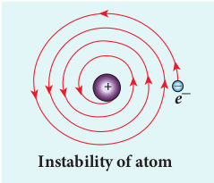
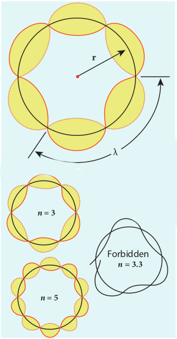
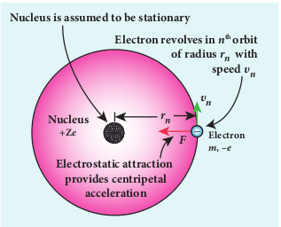
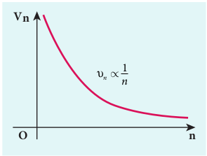
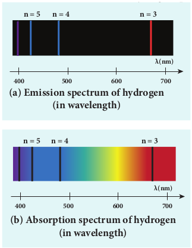

**ATOM MODELS**

**Introduction** Around 400 B.C, Greek philosophers

Leucippus and Democretus proposed the concept of atom, ‘Every object on continued subdivision ultimately yields atoms’. Later, many physicists and chemists tried to understand the nature with the idea of atoms. Many theories were proposed to explain the properties (physical and chemical) of bulk materials on the basis of atomic model.

For instance, J. J. Thomson proposed a theoretical atom model which is based on static distribution of electric charges. Since this model fails to explain the stability of atom, one of his students E. Rutherford proposed the first dynamic model of an atom. Rutherford gave atom model which is based on results of an experiment done by his students (Geiger and Marsden). But this model also failed to explain the stability of the atom.

Later, Niels Bohr who is also a student of Rutherford proposed an atomic model for hydrogen atom which is more successful than other two models. Niels Bohr atom model could explain the stability of the atom and also the origin of line spectrum. There are other atom models, such as Sommerfeld’s atom model and atom model from wave mechanics (quantum mechanics). But we will restrict ourselves only to very simple (mathematically simple) atom model in this section.

**9.3**  

### J. J. Thomson’s Model (Water melon model)

In this model, the atoms are visualized as homogeneous spheres which contain uniform distribution of positively charged particles (Figure 9.8 (a)). The negatively charged particles known as electrons are embedded in it like seeds in water melon as shown in Figure 9.8 (b).
<!-- 
\_ \_

\_\_ \_

\_ -->

Positively charged material

<!-- **10 m–10** -->

 **Figure (9.8)** (a) Atom (b) Water melon
The atoms are electrically neutral, this implies that the total positive charge in an atom is equal to the total negative charge. According to this model, all the charges are assumed to be at rest. But from classical electrodynamics, no stable equilibrium points exist in electrostatic configuration (this is known as Earnshaw’s theorem) and hence such an atom cannot be stable. Further, it fails to explain the origin of spectral lines observed in the spectrum of hydrogen atom and other atoms.

### Rutherford’s model

In 1911, Geiger and Marsden did a remarkable experiment based on the advice of their teacher Rutherford, which is known as scattering of alpha particles by gold foil.

The experimental arrangement is shown in Figure 9.9. A source of alpha particles (radioactive material, example polonium) is kept inside a thick lead box with a fine hole as seen in Figure 9.9. The alpha particles coming through the fine hole of lead box pass through another fine hole made on the lead screen. These particles are now allowed to fall on a thin gold foil and it is observed that the alpha particles passing through gold foil are scattered through different angles. A movable screen (from 0° to 180°) which is made up of zinc sulphide (ZnS) is kept on the other side of the gold foil to collect the scattered alpha particles. Whenever alpha particles strike the screen, a flash of light is observed which can be seen through a microscope.

Rutherford proposed an atom model based on the results of alpha scattering

<!-- **+**

**Lead ScreenLead Block**

**Polonium sample** -->

<!-- \_ \_

\_

\_ \_

\_ \_ \_

\_ \_ -->

<!-- **Expected Observed**

**(a) (b)**

**+** -->

**Figure(9.10)** In alpha scattering experiment – result (c) The variation of alpha particles scatt

experiment. In this experiment, alpha particles (positively charged particles) were allowed to fall on the atoms of a metallic gold foil. The results of this experiment are given below and are shown in Figure 9.10, Rutherford expected the atom model to be as seen in Figure 9.10 (a) but the experiment showed the model as in Figure 9.10 (b). (a) Most of the alpha particles were

un-deflected through the gold foil and went straight.

(b) Some of the alpha particles were deflected through a small angle.

(c) A few alpha particles (one in thousand) were deflected through the angle more than 90°
of alpha particles experiment by Rutherford

<!-- ## 40 60 80 100 120 140 160 180 10

## 104 105 106 107

**N um**

**be r o**

**f s ca**

**tt er**

**ed p**

**ar tic**

**le s d**

**et ec**

**te d**

**Scattering angle _θ (_in degree)(c)** -->

<!-- (a) Rutherford expected (b) experiment ered N(θ) with scattering angle θ -->

<!-- | light |
|------|------|------|
|  |
| Gold |Sc atteangl | -->
  

(d) Very few alpha particles returned back (back scattered) –that is, deflected back by 180°

In Figure 9.10 (c), the dotted points are the alpha scattering experiment data points obtained by Geiger and Marsden and the solid curve is the prediction from Rutherford’s nuclear model. It is observed that the Rutherford’s nuclear model is in good agreement with the experimental data.

**Conclusion made by Rutherford based on the above observation**

From the experimental observations, Rutherford proposed that an atom has a lot of empty space and contains a tiny matter at its centre known as nucleus whose size is of the order of \(10^{-14} \, \text{m}\)
. The nucleus is positively charged and most of the mass of the atom is concentrated in the nucleus. The nucleus is surrounded by negatively charged electrons. Since static charge distribution cannot be in a stable equilibrium, he suggested that the electrons are not at rest and they revolve around the nucleus in circular orbits like planets revolving around the sun.

**(a) Distance of closest approach**

**_b_ Impact parameter gold nucleusdistance of closed approachAlpha particles _r0_**

When an alpha particle moves straight towards the nucleus, it reaches a point where it comes to rest momentarily and returns back as shown in Figure 9.11. **The minimum distance between the centre**  

**of the nucleus and the alpha particle just before it gets reflected back through 180**° **is defined as the distance of closest approach r0 (also known as contact distance)**. At this distance, all the kinetic energy of the alpha particle will be converted into electrostatic potential energy (Refer unit 1, volume 1 of +2 physics text book).

\[ \frac{1}{2}m{v_0}^2 = \frac{1}{4\pi\varepsilon_0} \frac{2eZ_e}{r_0} \]

\[ r_0 = \frac{1}{4\pi\varepsilon_0} \frac{2Ze^2} {\frac{1}{2} m{v_0}^2} = \frac{1}{4\pi\varepsilon_0} \frac{2Ze^2} {E_k} \]

where _Ek_ is the kinetic energy of the alpha particle.This is used to estimate the size of the nucleus but size of the nucleus is always lesser than the distance of closest approach. Further, Rutherford calculated the radius of the nucleus for different nuclei and found that it ranges from 10–14 m to 10–15 m.

<!-- **(b) Impact parameter**

**θ**

**Nucleus**

**b**

**Alpha particle** +

\+ **90**°**Alpha particle at a very**

**large distance** -->

**The** **impact parameter** (_b_) (see Figure 9.12) **is defined as the perpendicular distance between the centre of the gold nucleus and the direction of velocity vector of alpha particle when it is at a large distance**. The relation between impact parameter and scattering angle can be shown as

\[ b \propto \cot\left(\frac{\theta}{2}\right) \Rightarrow b = K \cot\left(\frac{\theta}{2}\right) \]     (9.13)

where \[ K = \frac{1}{4\pi\varepsilon_0} \frac{2Ze^2}{mv_0^2} \] and θ is called

scattering angle. Equation (9.13) implies that when impact parameter increases, the scattering angle decreases. Smaller the impact parameter, larger will be the deflection of alpha particles.

**Drawbacks of Rutherford model** Rutherford atom model helps in the

calculation of the diameter of the nucleus and also the size of the atom but has the following limitations:

(a) This model fails to explain the distribution of electrons around the nucleus and also the stability of the atom.

**Instability of atom**

**_e\__** \+ \_

According to classical electrodynamics, any accelerated charge should emit electromagnetic radiations continuously. Due to emission of radiations, the charge loses its energy. Hence, it can no longer sustain the circular motion. The radius of the orbit, therefore, becomes smaller and smaller (undergoes spiral motion) as shown in Figure 9.13 and finally the electron should fall into the nucleus and the atoms should disintegrate. But this does not happen.  

Hence, Rutherford model could not account for the stability of atoms.

(b) According to this model, emission of radiation must be continuous and must give continuous emission spectrum but experimentally we observe only line (discrete) emission spectrum for atoms.

### Bohr atom model

In order to overcome the limitations of the Rutherford atom model in explaining the stability and also the line spectrum observed for a hydrogen atom (Figure 9.14), Niels Bohr made modifications in Rutherford atom model. He is the first person to give better theoretical model of the structure of an atom to explain the line spectrum of hydrogen atom. The following are the assumptions (postulates) made by Bohr.

**Figure 9.14 The line spectrum of** hydrogen

**Postulates of Bohr atom model:** (a) The electron in an atom moves

around nucleus in circular orbits under the influence of Coulomb electrostatic force of attraction. This Coulomb force gives necessary centripetal force for the electron to undergo circular motion.

(b) Electrons in an atom revolve around the nucleus only in certain discrete orbits called stationary orbits and electron in such orbits do not radiate electromagnetic energy. Only those discrete orbits allowed are stable orbits.

The angular momentum of the electron in these stationary orbits are quantized – that is, it can be written as an integer or integral multiple of \[ \frac{h}{2\pi} \] called as reduced Planck’s constant – that is, _h_(read it as h-bar) and the integer _n_ is called as principal quantum number.

\[ l = nh \]

where \[ h = \frac{h}{2\pi} \]

This condition is known as angular momentum quantization condition.

According to quantum mechanics, particles like electrons have dual nature (Refer unit 8, volume 2 of +2 physics text book). The standing wave pattern of the de Broglie wave associated with orbiting electron in a stable orbit is shown in Figure 9.15.

<!-- λ

**r**

**_n_ = 5**

**_n_ = 3.3**

**_n_ = 3** -->

<!-- Forbidden -->

The circumference of an electron’s orbit of radius _r_ must be an integral multiple of de Broglie wavelength – that is,

2πr =nλ                     (9.14) where n = 1,2,3,......

But the de Broglie wavelength (_λ_) associated with an electron of mass _m_ moving with velocity _υ_ is \[ \lambda = \frac{h}{mv} \] where _h_ is called Planck’s constant. Thus from equation (9.14),

\[2\pi r = \frac{n h}{mv}\]

\[mvr = \frac{n h}{2\pi}\

For any particle of mass _m_ undergoing circular motion with radius _r_ and velocity _υ_, the magnitude of angular momentum _l_ is given by

\[ l = r \cdot mv \]

\[ mvr = l = nh \]

(c) Energy of the electron in orbits is not continuous but only discrete. This is called the quantization of energy. An electron can jump from one orbit to another orbit by absorbing or emitting a photon whose energy is equal to the difference in energy (ΔE) between the two orbital levels (Figure 9.16)

\[ \Delta E = E_{\text{final}} - E_{\text{initial}} = hv = \frac{hc}{\gamma} \]

 where _c_ is the speed of light and λ is the

wavelength and _v_ is the frequency of the radiation emitted. Thus, the frequency of the radiation emitted is related only to change in atomic energy levels and it does not depend on frequency of orbital motion of the electron.

<!-- **_hv hv_**

**_e\__**

**_e\__**

**_e\__**

**E _f_**

**E_i_**

**E _f_**

**E_i_** \_

\_

\_ -->

<!-- 
| r |
|------|------|------|
| λ |
   -->

**Radius of the orbit of the electron and velocity of the electron**

Consider an atom which contains the nucleus at rest and an electron revolving around the nucleus in a circular orbit of radius _rn_ as shown in Figure 9.17. Nucleus is made up of protons and neutrons. Since proton is positively charged and neutron is electrically neutral, the charge of a nucleus is entirely due to the charge of protons.

**EXAMPLE 9.1**

The radius of the 5th orbit of hydrogen atom is 13.25 Å. Calculate the de broglie wavelength of the electron orbitting in the 5th orbit.

**Solution:**

\[ 2\pi r = n\lambda \]

\[ 2 \times 3.14 \times 13.25 \, \text{Å} = 5 \times \lambda \Rightarrow \lambda = 16.64 \, \text{Å} \]

**EXAMPLE 9.2**

Find the (i) angular momentum (ii) velocity of the electron revolving in the 5th orbit of hydrogen atom.

\[ h = 6.6 \times 10^{-34} \, \text{Js} \]

\[ m = 9.1 \times 10^{-31} \, \text{kg} \]

**Solution** (i) Angular momentum is given by

\[ \lambda = \frac{nh}{2\pi} = \frac{5 \times 6.6 \times 10^{-34}}{2 \times 3.14} \]

\[ \lambda \approx 5.25 \times 10^{-34} \, \text{kg} \cdot \text{m}^2 \cdot \text{s}^{-1} \]

(ii) Velocity is given by

Velocity \[ \nu = \frac{\lambda}{mr} = \frac{5.25 \times 10^{-34} \, \text{kg} \cdot \text{m}^2 \cdot \text{s}^{-1}}{9.1 \times 10^{-31} \, \text{kg} \cdot 13.25 \times 10^{-10} \, \text{m}} \]

\[ \nu \approx 4.4 \times 10^5 \, \text{m/s}^{-1} \]

 

<!-- **_rn_**

**_υn_**

**Electron _m_, –_e_**

**Electrostatic attraction provides centripetal**

**acceleration**

**_F \__**

**Nucleus is assumed to be stationary**

**Electron revolves in _n_th orbit of radius _rn_ with**

**speed _υn_**

**Nucleus +Z_e_ +** -->

Let _Z_ be the atomic number of the atom, then +_Ze_ is the charge of the nucleus. Let –_e_ be the charge of the electron. From Coulomb’s law, the force of attraction between the nucleus and the electron is
 
\[
\overset{\rightarrow}{F}_{\text{Coulomb}} = \frac{1}{4\pi\varepsilon_0} \frac{+Ze \cdot (-e)}{r^2_n r}
\]

 \[
   = -\frac{1}{4\pi\varepsilon_0} \frac{Ze^2}{r_n^2} \cdot \overset{\hat{}}{r}
\]

This force provides necessary centripetal force

\[ F_{\text{centripetal}} = \frac{mv^2_n}{r_n} \cdot \overset{\hat{}}{r} \]

where _m_ be the mass of the electron that moves with a velocity _υ_n in a circular orbit. Therefore,

\[ |\overset{\rightarrow}{F}_{\text{Coulomb}}| = |\overset{\rightarrow}{F}_{\text{centripetal}}| \]

\[ \frac{1}{4\pi\varepsilon_0} \frac{Ze^2}{r_n^2} = \frac{mv_n^2}{r_n} \]

Multiplied and divided by ‘_m_’

\[ r_n = \frac{4\pi\varepsilon_0(mv_nr_n)^2}{Ze^2} \]

From Bohr’s assumption, the angular momentum quantization condition, 

\[ mv_nr_n = l_n = n \],

| EXAMPLE 9 . 2Find t he (i) a ngular m omentum (ii) velocity of the electron revolving in the 5  orbit of  hydrogen atom.(h = 6.6 × 10 Js, m = 9.1 × 10 kg)Solutionth(i) Angular momentum is given by–34  –31nhln==2π56××.61 0= =×52.k51 0 gm s23× .14−34−−34 21 |
|------|
| (ii) Velocity is given bylVelocity υ =mr(.52 51× 0 kgms )=(.91 ××10 kg)(13.25 10 mm)υ =×44. 10 ms−−34 21−−31 1051 − |

  
\( h = 6.6 \times 10^{-34} \, \text{Js} \)
\( m = 9.1 \times 10^{-31} \, \text{kg} \)

∴ 

\[ l = nh = \frac{nh}{2\pi} \]

\[ l = \frac{5 \times 6.6 \times 10^{-34}}{2 \times 3.14} \]

\[ l = 5.25 \times 10^{-34} \, \text{kg} \cdot \text{m}^2 \cdot \text{s}^{-1} \]

\[ v = \frac{l}{mr} \]

\[ v = \frac{5.25 \times 10^{-34} \, \text{kg} \cdot \text{m}^2 \cdot \text{s}^{-1}}{(9.1 \times 10^{-31} \, \text{kg})(13.25 \times 10^{-10} \, \text{m})} \]

\[ v = 4.4 \times 10^5 \, \text{m/s}^{-1} \]

 (9.16)

where _n_Î . Since, ε0, _h, e_ and π are constants. Therefore, the radius of the orbit becomes

_r a n Zn_ \= 0

2

where _a h me_0 0

2

2 0 529= = ε π

. Å. This is

known as Bohr radius which is the smallest radius of the orbit in hydrogen atom. Bohr radius is also used as unit of length called Bohr. 1 Bohr = 0.53 Å. For hydrogen atom (Z = 1), the radius of nth orbit is

\[ r_n = a_0n^2 \]

For \( n = 1 \) (first orbit or ground state),
\[ r_1 = a_0 = 0.529 \, \text{Å} \]

For \( n = 2 \) (second orbit or first excited state),
\[ r_2 = 4a_0 = 2.116 \, \text{Å} \]

For \( n = 3 \) (third orbit or second excited state),
\[ r_3 = 9a_0 = 4.761 \, \text{Å} \]

and so on.

Thus the radius of the orbit from centre increases with (\(n\)), that is, \[ r_n \propto n^2 \] as shown in Figure 9.18.

Further, Bohr’s angular momentum quantization condition leads to

\[ \frac{mv_na_0n^2}{Z} = \frac{nh}{2\pi} \]  \[ (∴  r_n = \frac{a_0 n^2}{Z}) \]

∴ 

<!-- **r2= 4r1**

**r4= 16r1**

**r3= 9r1**

**r1** -->

\[ v_n = \frac{h}{2\pi m a_0 Z} \frac{Z}{n} \]

in atomic physics \[ v_n \propto \frac{1}{n}

Note that the velocity of electron decreases as the principal quantum number (orbit number) increases as shown in Figure 9.19. This curve is the rectangular hyperbola. This implies that the velocity of electron in ground state is maximum when compared to that in excited states.

**Vn**

**O n**

<!-- υ_n n_ µ 1 -->

<!-- | r= 3 |
|------|------| -->

  

**The energy of an electron in the _n_th orbit** Since the electrostatic force is a conservative

force, the potential energy for the _n_**th** orbit is

\[ U_n = \frac{1}{4\pi\varepsilon_0} \frac{(+Ze)(-e)}{r_n} = -\frac{1}{4\pi\varepsilon_0} \frac{Ze^2}{r_n} \]

\[ U_n = -\frac{1}{4\varepsilon_0^2} \frac{Z^2me^4}{h^2n^2} \]

The kinetic energy of the electron in _n^th_ orbit is

\[ KE_n = \frac{1}{2}m c_n^2 = \frac{me^4}{8\epsilon_0^2 h^2} \frac{Z^2}{n^2} \]

This implies that Un = –2 KEn. Total energy of the electron in in the _nth_ orbit is

\[ E_n = KE_n + U_n = KE_n - 2KE_n = -KE_n \]

\[ E_n = -\frac{me^2}{8\epsilon_0^2h^2} \frac{Z^2}{n^2} \]  

For hydrogen atom (Z = 1),

\[ E_n = -\frac{me^2}{8\epsilon_0^2h^2} \frac{1}{n^2} \] joule          (9.17)

where _n_ stands for principal quantum number. The negative sign in equation (9.17) indicates that the electron is bound to the nucleus.

Substituting the values of mass and charge of an electron (_m_ and _e_), permittivity of free space ε0 and Planck’s constant _h_ and expressing energy in terms of electron(+(_eV_)), we get

\[ E_n = -13.6 \frac{1}{n^2} \, \text{eV} \]

For the first orbit (ground state), the total energy of electron is E1= – 13.6 _eV_. For the second orbit (first excited state), the total energy of electron is E2= –3.4 _eV_. For the third orbit (second excited state), the total energy of electron is E3= –1.51 _eV_ and so on.  

Notice that the energy of the first excited state is greater than that of the ground state, second excited state is greater than that of the first excited state and so on. Thus, the orbit which is closest to the nucleus (_r_1) has lowest energy (minimum energy what it is compared with other orbits). So, it is often called ground state energy (lowest energy state). The ground state energy of hydrogen (–13.6 _eV_ ) is used as a unit of energy called Rydberg (1 Rydberg = –13.6 _eV_ ).

The negative value of this energy is because of the way the zero of the potential energy is defined. When the electron is taken away to an infinite distance (very far distance) from nucleus, both the potential energy and kinetic energy terms vanish and hence the total energy also vanishes.

The energy level diagram along with the shape of the orbits for increasing values of _n_ are shown in Figure 9.20. It shows that the energies of the excited states come closer and closer together when the principal quantum number _n_ takes higher values.

**EXAMPLE 9.3**

(a) Show that the ratio of velocity of an electron in the first Bohr orbit to the speed of light _c_ is a dimensionless number.

(b) Compute the velocity of electrons in ground state, first excited state and second excited state in Bohr atom model for hydrogen atom.

**_Solution_**

(a) The velocity of an electron in _n_th orbit is

\[ v_n = \frac{h}{2\pi m a_0 Z} \frac{1}{n} \]

where \( a_0 = \frac{\epsilon_0 h^2}{\pi m e^2} = \) Bohr radius. Substituting

for _a_0 in _υ_n,

\[ v_n = \frac{e^2}{2\epsilon_0 h} \frac{Z}{n} = c \left(\frac{e^2}{2\epsilon_0 hc}\right) \frac{Z}{n} = \alpha c \frac{Z}{n} \]  

where _c_ is the speed of light in free space or vacuum and its value is _c_ \= 3 × 10^8 m s–1and α is called fine structure constant.

For a hydrogen atom, _Z_ = 1 and for the first orbit, _n_ \= 1, the ratio of velocity of electron in first orbit to the speed of light in vacuum or free space is

<!-- **n = 1**

**n = 2**

**n = 3 n = 4 n = 5 n = ∞** -->

**Figure 9.20 Energy levels of a hydrogen atom**  

<!-- υ α ε

1 2

02_c e_

_hc_ \= =

α= × × ×

× × ×

−

− − −

−

( . ) ( . )

( . )

1 6 10 2 8 854 10

1 6 6 10

19 2

12 2 1 2

34

C C N m

Nms ( )3 108 1× −ms

≈ =1 136 9

1 137.

which is a dimensionless

number

**Energy, J Energy, eV 0 0**

**—0.87×10−19**

**—1.36×10−19**

**—2.42×10−19**

**—5.43×10−19**

**—21.76×10−19**

**—3.40**

**—13.6**

**—1.51**

**—0.54 —0.85**

**Free electron**

**Excited states**

**Ground state** -->

 \[ \frac{v_1}{c} = \alpha = \frac{e^2}{2\epsilon_0hc} \]

\[ \alpha = \frac{(1.6 \times 10^{-19} \, \text{C})^2}{2 \times (8.854 \times 10^{-12} \, \text{C}^2 \, \text{N}^{-1} \, \text{m}^{-2}) \times (6.6 \times 10^{-34} \, \text{Nms}) \times (3 \times 10^8 \, \text{ms}^{-1})} \]

\[ \alpha \approx \frac{1}{136.9} \approx \frac{1}{137} \] 
  

\[ \Rightarrow \alpha = \frac{1}{137} \]

(b) Using fine structure constant, the velocity of electron can be written as

\[ v_n = \alpha \frac{cZ}{n} \]

For a hydrogen atom (\(Z = 1\)), the velocity of the electron in the \(n\)-th orbit is

\[ v_n = \frac{c}{137n} \approx (2.19 \times 10^6) \frac{1}{n} \, \text{m/s} \]

For the first orbit (ground state), the velocity of the electron is

\[ v_1 = 2.19 \times 10^6 \, \text{m/s} \]

For the second orbit (first excited state), the velocity of the electron is

\[ v_2 = 1.095 \times 10^6 \, \text{m/s} \]

For the third orbit (second excited state), the velocity of the electron is

\[ v_3 = 0.73 \times 10^6 \, \text{m/s} \]

Here, \(v_1 > v_2 > v_3\).

**EXAMPLE 9.4**

The Bohr atom model is derived with the assumption that the nucleus of the atom is stationary and only electrons revolve around the nucleus. Suppose the nucleus is also in motion, then calculate the energy of this new system.

**_Solution_**

Let the mass of the electron be _m_ and mass of the nucleus be _M_. Since there is no external force acting on the system, the centre of mass of hydrogen atom remains at rest. Hence, both nucleus and electron move about the centre of mass as shown in figure.  

<!-- **Mm**

**r1r2**

**COM** -->

Let _V_ be the velocity of the nuclear motion and _υ_ be the velocity of electron motion. Since the total linear momentum of the system is zero,

\[ -mv + Mv = 0 \quad \text{or} \quad MV = mv = p \]

\[ \overrightarrow{P_e} + \overrightarrow{P_n} = 0 \quad \text{or} \quad |\overrightarrow{P_e}| = |\overrightarrow{P_n}| = \overrightarrow{P} \]

Hence, the kinetic energy of the system is

\[ KE = \frac{P_n^2}{2M} + \frac{P_e^2}{2m} = \frac{P^2}{2} \left(\frac{1}{M} + \frac{1}{m}\right) \]

Let \( \frac{1}{M} + \frac{1}{m} = \frac{1}{\mu_m} \)

Here the reduced mass is \( \mu_m = \frac{mM}{M+m} \)

Therefore, the kinetic energy of the system now is \( KE = \frac{P^2}{2\mu_m} \)

Since the potential energy of the system is same, the total energy of the hydrogen can be expressed by replacing mass by reduced mass, which is

\[ E_n = -\frac{\mu_me^4}{8\sigma_0^2h^2} \frac{1}{n^2} \]

Since the nucleus is very heavy compared to the electron, the reduced mass is closer to the mass of the electron.

<!-- | M |
|------|------|------|
| COM |
| r2 |r1 | -->

  

In 1931, H.C. Urey and co- workers noticed that in the shorter wavelength region

of the hydrogen spectrum lines, faint companion lines are observed. From the isotope displacement effect (isotope shift), the isotope of the same element can produce slightly different spectral lines. The presence of these faint lines confirmed the existence of isotopes of hydrogen atom (which is named as Deuterium).

On calculating wavelength or wave number difference between the faint and bright spectral lines, atomic mass of deuterium is measured to be twice that of atomic mass of hydrogen atom. Bohr atom model could not explain this isotopic shift. Thus by considering nuclear motion (although the movement of the nucleus is much smaller) into account in the Bohr atom model, the wave number or wavelength difference between the lines produces by the hydrogen atom and deuterium is theoretically calculated which perfectly agreed with the spectroscopic measured values.

The difference between hydrogen atom and deuterium is in the number of neutron. Hydrogen atom contains an electron and a proton, whereas deuterium has an electron, a proton and a neutron.

**Note**

**Excitation energy and excitation potential The energy required to excite an**

**electron from lower energy state to any higher energy state is known as excitation energy.**

The excitation energy for an electron from ground state (n = 1) to first excited state (n = 2) is called first excitation energy.

For hydrogen atom, it is  

\[ E_I = E_2 - E_1 = -3.4 \, \text{eV} - (-13.6 \, \text{eV}) = 10.2 \, \text{eV} \]

Similarly, the excitation energy for an electron from ground state (\(n = 1\)) to the second excited state (\(n = 3\)) is called the second excitation energy, which is \(E_{II} = E_3 - E_1 = -1.51 \, \text{eV} - (-13.6 \, \text{eV}) = 12.1 \, \text{eV}\)

and so on. **Excitation potential is defined as**

**excitation energy per unit charge.** For hydrogen atom, the first excitation

state energy is

\[ E_I = eV_I \]

First excitation potential for hydrogen atom is,

\[ V_I = \frac{1}{e} E_I = 10.2 \, \text{volt} \]

Similarly, the second excitation potential is

\[ V_{II} = \frac{1}{e} E_{II} = 12.1 \, \text{volt} \]

and so on.

**Ionization energy and ionization potential** An atom is said to be ionized when an electron is completely removed from the atom – that is, it reaches the state with energy _En_→∞ . **The minimum energy required to remove an electron from an atom in the ground state is known as binding energy or ionization energy**.

For hydrogen atom, the ground state ionization energy is,

\[ E_{\text{ionization}} = E_{\infty} - E_1 = 0 - (-13.6 \, \text{eV}) = 13.6 \, \text{eV} \]

When an electron is in _n_th state of an atom, the energy required to remove an electron from that state – that is, the corresponding ionization energy is

\[ E_{\text{ionization}} = E_{\infty} - E_1 = 0 - \left(-\frac{13.6}{n^2} Z^2 \, \text{eV}\right) = \frac{13.6}{n^2} Z^2 \, \text{eV} \]

At normal room temperature, the electron in a hydrogen atom (_Z_\=1) spends most of

  

**energy required to remove an electron from the ground state of an atom to the outer most orbit _(E = 0_ for _n_→∞_)_ is known as first ionization energy (13.6 _e_V).** Then, the hydrogen atom is said to be in ionized state or simply called as hydrogen ion, denoted by _H_+. If we supply more energy than the ionization energy, the excess energy appear as the kinetic energy of the free electron.

**Ionization potential is defined as ionization energy per unit charge.**

\[ V_{\text{ionization}} = \frac{1}{e} \]

\[ E_{\text{ionization}} = \frac{13.6}{n^2} Z^2 V \]

Thus, for a hydrogen atom (Z =1), the ionization potential is

\[ V = \frac{13.6}{n^2} \, \text{volt} \]

The radius, velocity and total energy in ground state, first excited state and second excited state are given in Table 9.1.

**EXAMPLE 9.5**

Suppose the energy of an electron in hydrogen–like atom is given as

\[ E_n = -\frac{54.4}{n^2} \, \text{eV} \]_E_n_ =-54.4/n^2 eV

V where _n_Î . Calculate

the following:

(a) Sketch the energy levels for this atom and compute its atomic number.

(b) If the atom is in ground state, compute its first excitation potential and also its ionization potential.

**Table 9.1** Physical quantity Ground state F

| **Physical quantity**                         | **Ground state**                       | **First excited state**                 | **Second excited state**              |
|-----------------------------------------------|----------------------------------------|-----------------------------------------|---------------------------------------|
| Radius (rn ∝ n2)        | 0.529 Å                                | 2.116 Å                                 | 4.761 Å                               |
| Velocity (vn ∝ n-1)     | 2.19 × 106 m s-1 | 1.095 × 106 m s-1 | 0.73 × 106m s-1 |
| Total Energy (En ∝ n-2) | –13.6 eV                               | –3.4 eV                                 | –1.51 eV                              | 

(c) When a photon with energy 42 _e_V and another photon with energy 51 _e_V are made to collide with this atom, does this atom absorb these photons?

(d) Determine the radius of its first Bohr orbit.

(e) Calculate the kinetic and potential energies of electron in the ground state.

**_Solutions_** (a) Given that

_E n_

_en_ \=− 54 4

2 . V

For _n_ = 1, the ground state energy E1 = –54.4 _e_V and for _n_ = 2, E2 = –13.6 _e_V. Similarly, E3 = –6.04 _e_V, E4 = –3.4 _e_V and so on.

For large value of principal quantum number – that is, _n = ∞,_ we get _E_∞ = 0 _e_V.

<!-- **n = 1**

**n = 2 n = 3 n = 4n = ∞0**

**—13.6 —6.04**

**—54.4(eV)**

**—3.4** -->

(b) For a hydrogen-like atom, ground state energy is

\[ E_1 = -\frac{13.6}{n^2} Z^2 \, \text{eV} \]

where _Z_ is the atomic number. Hence, comparing this energy with given energy, we get, – 13.6 _Z_2 = – 54.4 ⇒ _Z_ = ±2. Since, atomic number cannot be negative number, _Z_ = 2.

irst excited state Second excited state

.116 Å 4.761 Å

.095 × 106 m s-1 0.73 × 106 m s-1

3.4 _e_V –1.51 _e_V

  

The first excitation energy is 

\[ E_1 = E_2 - E_1 = -13.6 \, \text{eV} - (-54.4 \, \text{eV}) = 40.8 \, \text{eV} \]

Hence, the first excitation potential is

\[ V_1 = \frac{40.8 \, \text{eV}}{e} = 40.8 \, \text{volt} \]

The first ionization energy is

\[ E_{\text{ionization}} = E_{\infty} - E_1 = 0 - (-54.4 \, \text{eV}) = 54.4 \, \text{eV} \]

Hence, the first ionization potential is

\[ V_{\text{ionization}} = \frac{54.4 \, \text{eV}}{e} \]

  = 54.54 volt

(c) Consider two photons to be A and B. Given that photon A with energy 42 _e_V and photon B with energy 51 _e_V From Bohr assumption, difference in energy levels is equal to the energy photon absored, then atom will absorb energy, otherwise, not.

\[ E_2 - E_1 = -13.6 \, \text{eV} - (-54.4 \, \text{eV}) \]
        = 40.8eV = 41eV

Similarly, 

\[ E_3 - E_1 = -6.04 \, \text{eV} - (-54.4 \, \text{eV}) \]
         = 48.36eV

\[ E_4 - E_1 = -3.4 \, \text{eV} - (-54.4 \, \text{eV}) \]
         = 51eV

\[ E_3 - E_2 = -6.04 \, \text{eV} - (-13.6 \, \text{eV}) \]
         = 7.56eV         

and so on. But note that _E2 – E1_ ≠ 42 _e_V, _E3 – E1_ ≠ 42 _e_V, _E4 – E1_ ≠ 42 _e_V and _E3 – E2_ ≠ 42 _e_V.

For all possibilities, no difference in energy is an integer multiple of photon energy. Hence, photon A is not absorbed by this atom. But  

for Photon B, _E4 – E1_ \= 51 _e_V, which means, Photon B can be absorbed by this atom.

(d) The radius of Bohr orbit is _r a n zn_ \= ×0

2

For _n_ = 1, _z_ = 2

 r_1=a_0/2
   =0.529/2
   =0.265 Å
 
(e) Since, total energy is equal to negative of kinetic energy in Bohr atom model, we get

\[ KE_n = -E_n = -\left(-\frac{54.4}{n^2} \, \text{eV}\right) \]

Simplifying, we get:

\[ KE_n = \frac{54.4}{n^2} \, \text{eV} \]

Since, Potential energy is negative of twice the kinetic energy,

\[ U_n = -2KE_n = -2\left(\frac{54.4}{n^2} \, \text{eV}\right) \]

Simplifying, we get:

\[ U_n = -\frac{108.8}{n^2} \, \text{eV} \]

For a ground state, put n =1

Kinetic energy is \[ KE_1 = 54.4 \, \text{eV} \] and Potential energy is \[ U_1 = -108.8 \, \text{eV} \]

### Atomic spectra

Materials in the solid, liquid and gaseous states emit electromagnetic radiations when they are heated up and these emitted radiations usually exhibit continuous spectrum. For example, when white light is examined through a spectrometer, electromagnetic radiations of all wavelengths are observed which is a continuous spectrum.

In early twentieth century, many scientists spent considerable time in understanding the characteristic radiations emitted by the atoms of individual elements exposed to a flame or

electrical discharge. When they were viewed or photographed, instead of a continuous spectrum, the radiation contains of a set of discrete lines, each with characteristic wavelength. In other words, the wavelengths of the radiation obtained are well defined and their positions and intensities are characteristic of the element as shown in Figure 9.21.

This implies that these spectra are unique to each element and can be used to identify the element of the gas (like finger print used to identify a person) – that is, it varies from one gas to another gas. This uniqueness of line spectra of elements made the scientists to determine the composition of stars, sun and also used to identify the unknown compounds.

**Hydrogen spectrum** When the hydrogen gas enclosed in a tube is heated up, it emits electromagnetic radiations of certain sharply-defined characteristic wavelength (line spectrum), called hydrogen emission spectrum (Refer unit 5, volume 1 of +2 physics text book). The emission spectrum of hydrogen is shown in Figure 9.22(a).

When any gas is heated up, the thermal energy is supplied to excite the electrons. Similarly by all occurring light on the atoms, electrons can be excited. Once the

<!-- **n = 3n = 4n = 5**

**λ(nm)**

## 600 700

**(a) Emission spectrum of hydrogen (in wavelength)**

**Hydrogen s**

**_V_**

**High voltage dierence**

**Diraction grating**

**Low-pressure gas** -->

electrons get sufficient energy as given by Bohr’s postulate (c), it absorbs energy with particular wavelength (or frequency) and jumps from one stationary state (original state) to another state with those wavelengths (or frequencies) for the colours that are not observed are seen as dark lines in the absorption spectrum as shown in Figure 9.22 (b).

<!-- **n = 3n = 4 n = 4n = 5 n = 5**

**λ(nm)**

## 600 700 400 500 (a) Emission spectrum of hydrogen

**(in wavelength) (b) Absorption**

**(in**

**Hydrogen spectrum**

**n = 3n = 4n = 5**

**λ(nm)**

## 600 700

**(b) Absorption spectrum of hydrogen (in wavelength)**

**pectrum** -->

**Line spectrum**

Since electrons in excited states have very small life time, these electrons jump back to ground state through spontaneous emission in a short duration of time (approximately \(10^{-8}\) s) by emitting the radiation with same wavelength (or frequency) corresponding to the colours it absorbed (Figure 9.22 (a)). This is called emission spectroscopy.

The wavelengths of these lines can be calculated with great precision. Further, the emitted radiation contains wavelengths both lesser and greater than wavelengths of lines in the visible spectrum.

<!-- **—1.5**

**—3.4**

**—0.85 _E=0_**

**—5**

**—15 —13.6**

**—10**

**En er**

**gy (e**

**V )**

**Lyman series**

**n=1**

**n=2**

**n=3**

**λ= _hc E2 E1—_**

**_c_ \=**

**Ground state**

**(to calculate wavelengths and frequencies)**

**€e lowest energy level is called the ground state and all other states are called as excited states**

**Balmer series**

**Excited statesPaschen series**

**n=4 n=5 Ionised atom**

**(Continuous energy levels)**

**_v_**

**UV Visible light IR**

**Paschen seriesBalmer series Lyman**

**series**

**Wavelength, λ**

**91 n**

**m 12**

**2 nm**

**36 5**

**nm**

**65 6**

**nm**

**82 0**

**nm**

**18 75**

**n m** -->

Notice that the spectral lines of hydrogen as shown in Figure 9.23 are grouped in separate series. In each series, the distance of separation between the consecutive wavelengths decreases from higher wavelength to the lower wavelength, and also wavelength in each  

series approach a limiting value known as the series limit. These series are named as Lyman series, Balmer series, Paschen series, Brackett series, Pfund series, etc. The wavelengths of these spectral lines perfectly agree with the wavelengths calculate using equation derived from Bohr atom model.

\[ \frac{1}{\lambda} = R\left(\frac{1}{n^2} - \frac{1}{m^2}\right) = \vec{v} \] 

 (9.18)

where _v_ **is known as wave number which is inverse of wavelength,** _R_ is known as Rydberg constant whose value is 1.09737 × 107 m-1 and _m_ and _n_ are positive integers such that _m > n_. The various spectral series are discussed below:

**(a) Lyman series** For _n_ \= 1 and _m_ = 2,3,4....... in equation

(9.18), the wave numbers or wavelength of spectral lines of Lyman series which lies in ultra-violet region,
  
\[ \overrightarrow{v} = \frac{1}{\lambda} = R\left(\frac{1}{1^2} - \frac{1}{m^2}\right) \]

**(b) Balmer series** For _n =_ 2 and _m_ = 3,4,5....... in equation

(9.18), the wave numbers or wavelength of spectral lines of Balmer series which lies in visible region,

\[ \overrightarrow{v} = \frac{1}{\lambda} = R\left(\frac{1}{2^2} - \frac{1}{m^2}\right) \]

**(c) Paschen series** Put _n =_ 3 and _m_ = 4,5,6....... in equation

(9.18). The wave number or wavelength of spectral lines of Paschen series which lies in infra-red region (near IR) is

\[ \overrightarrow{v} = \frac{1}{\lambda} = R\left(\frac{1}{3^2} - \frac{1}{m^2}\right) \]

**(d) Brackett series** For _n =_ 4 and _m_ = 5,6,7........ in equation

(9.18), the wave numbers or wavelength of spectral lines of Brackett series which lies in infra-red region (middle IR),

\[ \overrightarrow{v} = \frac{1}{\lambda} = R\left(\frac{1}{4^2} - \frac{1}{m^2}\right) \]

**(e) Pfund series** For _n =_ 5 and _m_ = 6,7,8........ in equation

(9.18), the wave numbers or wavelength of spectral lines of Pfund series which lies in infra-red region (far IR),

\[ \overrightarrow{v} = \frac{1}{\lambda} = R\left(\frac{1}{5^2} - \frac{1}{m^2}\right) \]

Different spectral series are listed in Table 9.2.

**Table 9.2**

| n | m           | Series Name | Region      |
|---|-------------|-------------|-------------|
| 1 | 2,3,4.....  | Lyman       | Ultraviolet |
| 2 | 3,4,5.....  | Balmer      | Visible     |
| 3 | 4,5,6.....  | Paschen     | Infrared    |
| 4 | 5,6,7...... | Brackett    | Infrared    |
| 5 | 6,7,8.....  | Pfund       | Infrared    |

**Limitations of Bohr atom model** The following are the drawbacks of Bohr

atom model (a) Bohr atom model is valid only for

hydrogen atom or hydrogen like-atoms but not for complex atoms.

(b) When the spectral lines are closely examined, individual lines of hydrogen spectrum are accompanied by a number of faint lines. This is called **fine structure**. This cannot be explained by Bohr atom model.

(c) Bohr atom model fails to explain the intensity variations in the spectral lines.

(d) The distribution of electrons in various levels cannot be completely explained by Bohr atom model.