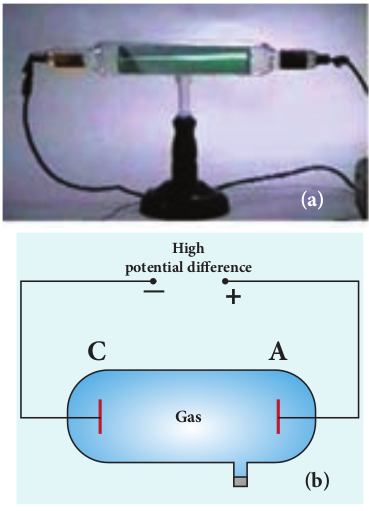
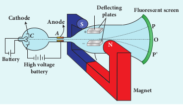
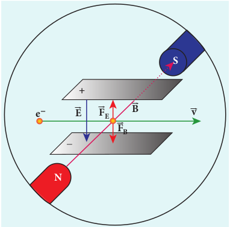
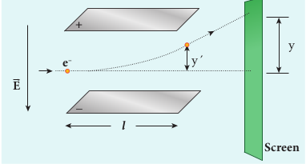
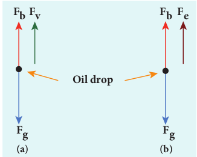

# ELECTRIC DISCHARGE THROUGH GASES
Gases at normal atmospheric pressure are poor conductors of electricity because they do not have free electrons for conduction.But by special arrangement, one can make a gas to conduct electricity.

A simple and convenient device used to study the conduction of electricity through gases is known as gas discharge tube. The arrangement of discharge tube is shown in Figure 9.2. It consists of a long closed glass tube (of length nearly 50 cm and diameter of 4 cm) inside of which a gas in pure form is filled usually. The small opening in the tube is connected to a high vacuum pump and a low-pressure gauge. This tube is fitted with two metallic plates known as electrodes which are connected to secondary of an induction coil. The electrode connected to positive of secondary is known as anode and the electrode to the negative of the secondary is cathode. The potential of secondary is maintained at about 50 kV.

 
**Figure 9.1 Discharge tube (a) real picture (b) schematic diagram**
 

Suppose the pressure of the gas in discharge tube is reduced to around 110 mm of Hg using vacuum pump, it is observed that no discharge takes place. When the pressure is kept near 100 mm of Hg, the discharge of electricity through the tube takes place. Consequently, irregular streaks of light appear and also crackling sound is produced. When the pressure is reduced to the order of 10 mm of Hg, a luminous column known as positive column is formed from anode to cathode.

When the pressure reaches to around 0.01 mm of Hg, positive column disappears. At this time, a dark space is formed between anode and cathode which is often called Crooke’s dark space and the walls of the tube appear with green colour. At this stage, some invisible rays emanate from cathode called cathode rays, which are later found be a beam of electrons.

**Properties of cathode rays** 

(1) Cathode rays possess energy and momentum and travel in a straight line with high speed of the order of 107 ms-1. It can be deflected by application of electric and magnetic fields. The direction of deflection indicates that they contain negatively charged particles.

(2) When the cathode rays are allowed to fall on matter, heat is produced. Cathode rays affect the photographic plates and also produce fluorescence when they fall on certain crystals and minerals.

(3) When the cathode rays fall on a material of high atomic weight, x-rays are produced.

(4) Cathode rays ionize the gas through which they pass.  

(5) The speed of cathode rays is up to(1/10)^{th} of the speed of light.

## Determination of specific charge (e/m) of an electron – Thomson’s experiment

Thomson’s experiment is considered as one among the landmark experiments for the birth of modern physics. In 1887, J. J. Thomson   made remarkable improvement in the study of gases in discharge tubes. In the presence of electric and magnetic fields, the cathode rays were deflected. By the variation of electric and magnetic fields, the specific charge (charge per unit mass) of the cathode rays is measured.

 
**Figure 9.1 Arrangement of J.J. Thomson experiment to determine the specific charge of an electron**

The arrangement of J. J. Thomson’s experiment is shown in Figure 9.3. A highly evacuated discharge tube is used and cathode rays (electron beam) produced at cathode are attracted towards anode disc A. Anode disc is provided with pin hole in order to allow only a narrow beam of cathode rays. These cathode rays are now allowed to pass through the parallel metal plates which are maintained at high voltage as shown in Figure 9.3. Further, the gas discharge tube is kept in between pole pieces of magnet such that both electric and magnetic fields are acting perpendicular to each other. When the cathode rays strike the screen, they produce scintillation and hence bright spot is observed. This is achieved by coating the screen with zinc sulphide.

**(i) Determination of velocity of cathode rays**

 
**Figure 9.1 Electric force balancing the magnetic force – the path of electron beam is a straight line**

For a fixed electric field between the plates, the magnetic field is adjusted such that the cathode rays (electron beam) strike at the original position O (Figure 9.3). This means that the magnitude of electric force is balanced by the magnitude of force due to magnetic field as shown in Figure 9.4. Let _e_ be the charge of the cathode rays, then


eE=ebv



\Rightarrow v = \frac{E}{B}   
(9.1)  

**(ii) Determination of specific charge** Since the cathode rays (electron beam) are accelerated from cathode to anode, the potential energy of the electron beam at the cathode is converted into kinetic energy of the electron beam at the anode. Let _V_ be the potential difference between anode and cathode, then the potential energy is _eV_. Then from law of conservation of energy,


 eV = \frac{1}{2}mv^2 \Rightarrow \frac{e}{m} = \frac{v^2}{2V} 


Substituting the value of velocity from equation (9.1), we get

 \frac{e}{m} = \frac{1}{2V} \frac{E^2}{B^2} 
(9.2)

Substituting the values of _E, B_ and _V_, the specific charge can be determined as

\frac{e}{m} = 1.7 \times 10^{11} \, \text{Ckg}^{-1} 


  <!--   p = \frac{m}{v}  
 -->

**(iii) Deflection of charge only due to uniform electric field**

When the magnetic field is turned off, the deflection is only due to electric field. The deflection in vertical direction is due to the electric force.

 F_e = eE 
  (9.3)

Let _m_ be the mass of the electron and by applying Newton’s second law of motion, acceleration of the electron is

 
a_e = \frac{1}{m} F_e  
(9.4)

Substituting equation (9.4) in equation (9.3),

 a_e = \frac{1}{m}eE = \frac{e}{m} E 


 
**Figure 9.1 Deviation of path by applying uniform electric field**

Let _y_ be the deviation produced from original position on the screen as shown in Figure 9.5. Let the initial upward velocity of cathode ray be _u_ = 0 before entering the parallel electric plates. Let _t_ be the time taken by the cathode rays to travel in electric field. Let _l_ be the length of one of the plates, then the time taken is


t = \frac{1}{\nu} 
 (9.5)

Hence, the deflection _yʹ_ of cathode rays is (note: _u_ \= 0 and  a_e = \frac{e}{m}E  )

  y' = ut + \frac{1}{2}at^2 \Rightarrow y' = ut + a_e t^2 

  
 =\frac{1}{2} \left( \frac{e}{m}E \right) \left( \frac{l}{\nu} \right)^2 
   

 
 y' = \frac{1}{2} \frac{e}{m} \frac{l^2B^2}{E}
   

Therefore, the deflection _y_ on the screen is

 
y \propto y' \Rightarrow y = Cy' 
 

where C is proportionality constant which depends on the geometry of the discharge tube and substituting _yʹ_ value in equation 9.6, we get  

  y = C \frac{1}{2} \frac{e}{m} \frac{l^2B^2}{E}  
   (9.7)

Rearranging equation (9.7) as

   \frac{e}{m} = \frac{2yE}{Cl^2B^2}  
  (9.8)

Substituting the values on RHS, the value of specific charge is calculated as   \frac{e}{m} = 1.7 \times 10^{11} \, \text{C/kg}^{-1}  
 .

**Note:**

The specific charge is independent of 

(a) gas used

(b) nature of the electrodes

## Determination of charge of an electron – Millikan’s oil drop experiment

Millikan’s oil drop experiment is another important experiment in modern physics which is used to determine one of the fundamental constants of nature known as charge of an electron (Figure 9.6 (a)).

By adjusting electric field suitably, the motion of oil drop inside the chamber can be controlled – that is, it can be made to move up or down or even kept balanced in the field of view for sufficiently long time.

The experimental arrangement is shown in Figure 9.6 (b). The apparatus consists of two horizontal circular metal plates A and B each with diameter around 20 cm and are separated by a small distance 1.5 cm. These two parallel 

 
**Figure 9.1 Millikan’s experiment (a) real picture and schematic picture (b) Side view picture**

plates are enclosed in a chamber with glass walls. Further, plates A and B are maintained at high potential difference around 10 _kV_ such that electric field acts vertically downward. A small hole is made at the centre of the upper plate A and an atomizer is kept exactly above the hole to spray the liquid. When a fine droplet of the highly viscous non volatile liquid (like glycerine) is sprayed using atomizer, they fall freely downward through the hole of the top plate only under the influence of gravity.

Few oil drops in the chamber can acquire electric charge (negative charge) because of friction with air or passage of x-rays in between the parallel plates. Further the chamber is illuminated by light which is passed horizontally and oil drops can be seen clearly using microscope placed perpendicular to the light beam. These drops can move either upwards or downward.

Let _m_ be the mass of the oil drop and _q_ be its charge. Then the forces acting on the droplet are

(a) gravitational force _Fg = mg_

(b) electric force _Fe = qE_

(c) buoyant force _Fb_

(d) viscous force _Fv_

 
**Figure 9.1 Free body diagram of the oil drop – (a) without electric field (b) with electric field**

**(a) Determination of radius of the droplet**

When the electric field is switched off, the oil drop accelerates downwards. Due to the presence of air drag forces, the oil drops easily attain its terminal velocity and moves with constant velocity. This velocity can be carefully measured by noting down the time taken by the oil drop to fall through a predetermined distance. The free body diagram of the oil drop is shown in Figure 9.7 (a), we note that viscous force and buoyant force balance the gravitational force.

Let the gravitational force acting on the oil drop (downward) be _Fg  = mg_

Let us assume that oil drop to be spherical in shape. Let ρ be the density of the oil drop, and _r_ be the radius of the oil drop, then the mass of the oil drop can be expressed in terms of its density as
  p = \frac{m}{v}  
  m = \rho \left(\frac{4}{3}\pi r^3\right)  
 (therefore volume of the sphere,   V = \frac{4}{3}\pi r^3  )

The gravitational force can be written in terms of density as

  F_g = mg  \Rightarrow   F_g = \rho \left(\frac{4}{3}\pi r^3\right)g  
Let σ be the density of the air, the upthrust force experienced by the oil drop due to displaced air is

  F_b = \sigma \left(\frac{4}{3}\pi r^3\right)g  
Once the oil drop attains a terminal velocity _υ_, the net downward force acting on the oil drop is equal to the viscous force acting opposite to the direction of motion of the oil drop. From Stokes law, the viscous force on the oil drop is

  F_v = 6\pi r \nu \eta  

From the free body diagram as shown in Figure 9.7 (a), the force balancing equation is

  F_g = F_b + F_v  
  \rho \left(\frac{4}{3}\pi r^3\right)g = \sigma \left(\frac{4}{3}\pi r^3\right)g + 6\pi r \nu \eta  
  \frac{4}{3} \pi r^3 (\rho - \sigma) g = 6\pi r \nu \eta  
  \frac{2}{3} \pi r^3 (\rho - \sigma) g = 3\pi r \nu \eta  
  r = \left( \frac{9 \nu \eta}{2(\rho - \sigma) g} \right)^{1/2}   (9.9)

Thus, equation (9.9) gives the radius of the oil drop.

**(b) Determination of electric charge** 

When the electric field is switched on, charged oil drops experience an upward electric force (_qE_). Among many drops, one particular drop can be chosen in the field of view of microscope and strength of the electric field is adjusted to make that particular drop to be stationary. Under these circumstances, there will be no viscous force acting on the oil drop. Then, from the free body diagram shown Figure 9.7 (b), the net force acting on the oil droplet is

  F_e = F_b + F_g  

  \Rightarrow  qE + \frac{4}{3}\pi^3 \sigma g = \frac{4}{3}\pi^3 \rho g  
  \Rightarrow  qE = \frac{4}{3}\pi^3 (\rho - \sigma) g  (9.10)
  \Rightarrow  q = \frac{4}{3} E \pi^3 (\rho - \sigma) g  (9.11)

Substituting equation (9.9) in equation (9.11), we get

  q = \frac{18\pi}{E} \left( \frac{n^3v^3}{2(\rho - \sigma)g} \right)^{1/2}(9.12)

Millikan repeated this experiment several times and computed the charges on oil drops. He found that the charge of any oil drop can be written as integral multiple of a basic value, -1.6 x 10-19 C, which is nothing but the charge of an electron.
