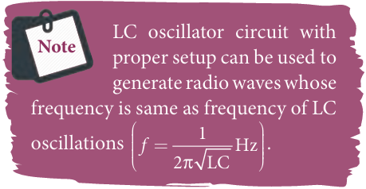
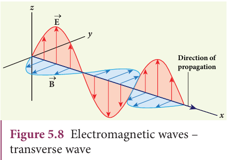
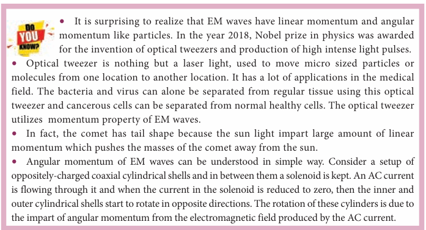
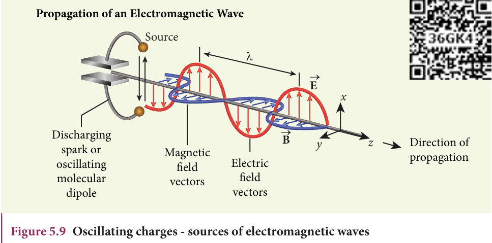
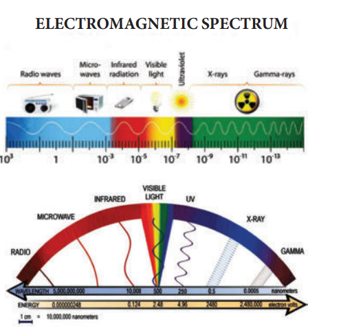

# Electromagnetic waves

**Electromagnetic waves are non- mechanical waves which move with speed equals to the speed of light (in vacuum).** It is a transverse wave. In the following subsections, we discuss the production of electromagnetic waves and its properties, sources of electromagnetic waves and also classification of electromagnetic spectrum.

## Production and properties of electromagnetic waves
**Production of electromagnetic waves - Hertz experiment**

Maxwell’s prediction was experimentally confirmed by Heinrich Rudolf Hertz in 1888. The experimental set up used is shown in Figure 5.7 (b).
It consists of two metal electrodes which are made of small spherical metals. These are connected to larger spheres and the ends of them are connected to induction coil with very large number of turns. This is to produce very high electromotive force (emf).

Since the coil is maintained at very high potential, air between the electrodes gets ionized and spark (spark means discharge of electricity) is produced. This discharge of electricity affects another electrode (ring type — not completely closed) which is kept at far distance. This implies that the energy is transmitted from electrode to the receiver (ring electrode) in the form of waves, known as electromagnetic waves.

If the receiver is rotated by 90°, then no spark is observed by the receiver. This confirms that electromagnetic waves are transverse waves as predicted by Maxwell. Hertz detected radio waves and also computed the speed of radio waves which is equal to the speed of light (3 × 108 m s–1).

**Properties of electromagnetic waves** 

1\. Electromagnetic waves are produced
by any accelerated charge. 

2\. Electromagnetic waves do not require any medium for propagation. So electromagnetic wave is a non-mechanical wave.

3\. Electromagnetic waves are transverse in nature. This means that the oscillating electric field vector, oscillating 
magnetic field vector and propagation vector 
(gives direction of propagation) are mutually perpendicular to 

each other. For example, if the electric and 
magnetic fields are as shown in Figure 5.8, 
then the direction of propagation will be 
along x-direction. 

4\. Electromagnetic waves travel with 
speed which is equal to the speed 
of light in vacuum or free space, 

c = = ×
1 3 108
ε µ 
ms-1,
 where εo is the permittivity of free space or vacuum and µo is the permeability of free space or vacuum (refer Unit 1 for permittivity and Unit 3 for permeability).

5\. In a medium with permittivity ε 
and permeability µ, the speed of 
electromagnetic wave is less than 
speed in free space or vacuum, that is, v < c. In a medium of refractive index

where εr is the relative permittivity of the medium (also known as dielectric constant) and µr is the relative permeability of the medium.

6\. Electromagnetic waves are not 
deflected by electric field or magnetic 
field.

7\. Electromagnetic waves can exhibit interference, diffraction and polarization.

8\.Like other waves, electromagnetic 
waves also carry energy, linear momentum 
and angular momentum. 

9\. If the electromagnetic wave incident on a 
material surface is completely absorbed, then 
the energy delivered is U and momentum 
imparted on the surface is 
p=U/C. 

10\. If the incident electromagnetic wave 
of energy U is totally reflected from the 
surface, then the momentum delivered to 

 the surface is ^p=U/C-(-U/C)=2U/C.

 
**EXAMPLE 5.2**

The relative magnetic permeability of the medium is 2.5 and the relative electrical permittivity of the medium is 2.25. Compute the refractive index of the medium.

**_Solution_**

Dielectric constant (relative permittivity of the medium), er = 2.25

Magnetic permeability, µr = 2.5

Refractive index of the medium,

## Sources of electromagnetic waves

Any stationary charge produces only electric field (refer Unit 1). When the charge moves with uniform velocity, it produces steady current which gives rise to magnetic field (not time dependent, only space dependent) around the conductor in which charge flows. If the charged particle accelerates, it produces magnetic field in addition to electric field. Both electric and magnetic fields are time varying fields. Since the electromagnetic waves are transverse waves, the direction of propagation of electromagnetic waves is perpendicular to the planes containing electric and magnetic field vectors.

Any oscillatory motion is also an accelerated motion. So, when the charge oscillates (oscillating molecular dipole) about their mean position (Figure 5.9), it produces electromagnetic waves.

Suppose the electromagnetic field in free space propagates along _z_\-direction and if the electric field vector points along _x_\-axis, then the magnetic field vector will be mutually perpendicular to both electric field and the direction of wave propagation. Thus

where _E_o and _B_o are amplitudes of oscillating electric and magnetic field, _k_ is a wave number, ω is the angular frequency of the

wave and k  (unit vector, here it is called propagation vector) denotes the direction of propagation of electromagnetic wave. Note that both electric field and magnetic field oscillate with a frequency (frequency of electromagnetic wave) which 
is equal to the frequency of the source (here, oscillating charge is the source 
for the production of electromagnetic waves).  
In free space or in vacuum, the ratio between Eo and Bo is equal to the speed of electromagnetic wave and is equal to speed of light c.

 In any medium, the ratio of Eo
 and Bo is equal to the speed of electromagnetic wave in that medium. Thus 

Further, the energy of electromagnetic waves comes from the energy of the 
oscillating charge.

**EXAMPLE 5.3**

Compute the speed of the electromagnetic wave in a medium if the amplitude of electric and magnetic fields are 3 × 104 N C–1 and 2 × 10–4 T, respectively.

**_Solution_**

The amplitude of the electric field, _E_o = 3 × 104 N C–1

The amplitude of the magnetic field, _B_o = 2 × 10–4 T. Therefore, speed of the electromagnetic wave in that medium is

   
## Electromagnetic spectrum

**Figure 5.10 Electromagnetic spectrum -**

Electromagnetic spectrum is an orderly distribution of electromagnetic waves in terms of wavelength or frequency (Figure 5.10). 

**Radio waves**

They are produced by accelerated motion of charges in conducting wires. The frequency range is from a few Hz to 109 Hz. They show reflection and diffraction.They are used in radio and television communication systems and also in cellular phones to transmit voice communication in the ultra high frequency band. 

**Microwaves**

It is produced by special vacuum tubes such as klystron, magnetron and gunndiode. The frequency range of microwaves is 109 Hz to 1011 Hz.These waves undergo reflection and can be polarised.
It is used in radar system for aircraft navigation, speed of the vehicle, microwave oven for cooking and very long distance wireless communication through satellites.

 **Infrared radiation**

It is produced by hot bodies (also known as heat waves) and also by when the molecules undergoing rotational and vibrational transitions. The frequency range is 1011 Hz to 4 × 1014 Hz.
It provides electrical energy to satellites by means of solar cells. It is used to produce dehydrated fruits, in green houses to keep the plants warm, heat therapy for muscular pain or sprain, TV remote as a signal carrier, 
to look through haze fog or mist and used in night vision or infrared photograph.

**Visible light**

It is produced by incandescent bodies and also it is radiated by excited atoms in gases. The frequency range is from 4 × 1014 Hz to 8 × 1014 Hz.

It obeys the laws of reflection and refraction. It undergoes interference, diffraction and can be polarised. It exhibits photo-electric effect also. It can be used to study the structure of molecules, arrangement of electrons in external shells of atoms. It causes sensation of vision.

**Ultraviolet radiation**

It is produced by Sun, arc and ionized gases. Its frequency range is from 8 × 1014 Hz to 1017 Hz.  It has less penetrating power. It can be absorbed by atmospheric ozone and is harmful to human body. It is used to destroy bacteria in sterilizing the surgical instruments, burglar alarm, to detect the invisible writing, finger prints and also in the study of atomic structure.

**X-rays** 

It is produced when there is sudden stopping of high speed electrons at high- atomic number target, and also by electronic transitions among the innermost orbits of atoms. The frequency range of X-rays is from 1017 Hz to 1019 Hz.
X-rays have more penetrating power than ultraviolet radiation. X-rays are used extensively in studying structures of inner atomic electron shells and crystal structures. It is used in detecting fractures, diseased organs, formation of bones and stones, observing the progress of healing bones. Further, in a finished metal product, it is 
used to detect faults, cracks, flaws and holes.

**Gamma rays**
It is produced by transitions of radioactive nuclei and decay of certain elementary particles. They produce chemical reactions on photographic plates, fluorescence, ionisation, diffraction. 
The frequency range is 1018 Hz and above. Gamma rays have higher penetrating power than X-rays and ultraviolet radiations; it has no charge but harmful to human body. 
Gamma rays provide information about the structure of atomic nuclei. It is used in radio therapy for the treatment of cancer and tumour, in food industry to kill pathogenic microorganism

**EXAMPLE 5.4**

A magnetron in a microwave oven emits electromagnetic waves (em waves) with frequency _f_ = 2450 MHz. What magnetic field strength is required for electrons to move in circular paths with this frequency?.

**_Solution_**

Frequency of the electromagnetic waves given, _f_ = 2450 MHz

The corresponding angular frequency is

_ω_ = 2π_f_ = 2 × 3.14 × 2450 × 106 = 15,386 × 106 Hz = 1.54 × 1010 s–1

The required magnetic field, _B m q e_\= ω

Mass of the electron, _me_ = 9.11 × 10–31 kg Charge of the electron,

This magnetic field can be easily produced with a permanent magnet. So, electromagnetic waves of frequency 2450 MHz can be used for heating and cooking food because they are strongly absorbed by water molecules.

