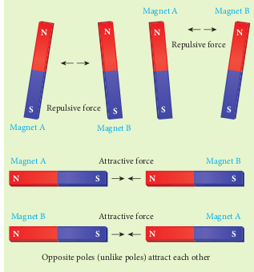
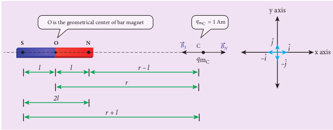
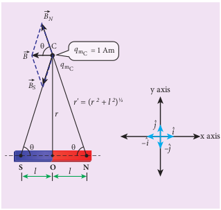
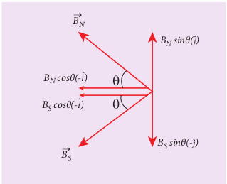

---
title: 'Coulombs Inverse Square Law Of Magnetism'
weight: 2
extensions:
- katex
---   
# COULOMB’S INVERSE SQUARE LAW OF MAGNETISM

Consider two bar magnets A and B as 
shown in Figure 3.11. When the north pole 
of magnet A and the north pole of magnet 
B or the south pole of magnet A and the 
south pole of magnet B are brought closer, 
they repel each other.

 On the other hand, when the north pole 
of magnet A and the south pole of magnet 
B or the south pole of magnet A and the 
north pole of magnet B are brought closer, 
their poles attract each other.

 This looks similar to Coulomb’s 
law for static charges studied in Unit I 
(opposite charges attract and like 
charges repel each other). So analogous 
to Coulomb’s law in electrostatics, we 
can state Coulomb’s law for magnetism 
(Figure 3.12) as follows: 

**Figure 3.11**: Magnetic poles behave like 
electric charges – like poles repel and 
unlike poles attract

**The force of attraction or repulsion 
between two magnetic poles is directly 
proportional to the product of their pole 
strengths and inversely proportional to 
the square of the distance between them.**

Mathematically, we can write

\vec{F} \text{\oe} {\frac{q_{m_{A}} q_{m_{B}}}{r^2}} \hat{r} 

where qmA and qmB are pole strengths of two poles and r is the distance between two magnetic poles. 

\vec{F} = K {\frac{q_{m_{A}} q_{m_{B}}}{r^2}} \hat{r} \;\;\;\;\;\;\;\;(3.7) 

In magnitude,  F =  K{\frac{q_{m_{A}} q_{m_{B}}}{r^2}} \;\;\;\;\;\;\;\;(3.8) 

where k is a proportionality constant whose valuedepends on the surrounding medium. In SI unit, the value of k for free space is k =µ0/4π ~~ 10-7 H m-1 , where μo is the absolute permeability of free space (air or 
vacuum) and H stands for henry.

**Figure 3.12** Coulomb’s law – force 
between two magnetic poles

**EXAMPLE 3.5**

The repulsive force between two magnetic 
poles in air is 9 × 10–3 N. 

If the two poles are equal in strength and are separated 
by a distance of 10 cm, calculate the pole 
strength of each pole.

**Solution:**

The magnitude of the force between two 
poles is given by

 F = K {\frac{q_{m_{A}} q_{m_{B}}}{r^2}} 

Given : F = 9 × 10–3N, r = 10 cm = 10 × 10–2 m

Since qmA = qmB = qm, we have

 9\times10^{-3} = 10^{-7} \times {\frac{q_{m}^{2}}{(10\times10^{-2})^{2}}} \Longrightarrow q_{m} = 30 N T ^{-1} 

## Magnetic field at a point along the axial line of the magnetic dipole (bar magnet)

Consider a bar magnet NS as shown in 
Figure 3.13. Let N be the north pole and S 
be the south pole of the bar magnet, each 
of pole strength qm and are separated by 
a distance of 2l. The magnetic field at a 
point C (lies along the axis of the magnet) 

**Figure 3.13** Magnetic field at a point along the axial line due to magnetic dipole

at a distance r from the geometrical centre 
O of the bar magnet can be computed by keeping unit north pole (qmC = 1 Am) at C. 

The magnetic field at C due to the north 
pole is 

 \vec B_{N} = {\frac{\mu_\circ}{4\pi}} {\frac{q_{m}}{(r-1)^{2}}} \widehat{i} \;\;\;\;\;\;(3.9) 

where (r – l) is the distance between north 
pole of the bar magnet and unit north pole 
at C. The magnetic field at C due to the south pole is 

 \vec B_{S} = -{\frac{\mu_\circ}{4\pi}} {\frac{q_{m}}{(r+1)^{2}}} \widehat{i} \;\;\;\;\;\;(3.10) 

where (r + l) is the distance between south 
pole of the bar magnet and unit north pole 
at C. 
 The net magnetic field due to the 
magnetic dipole at point C

 \vec{B} = \vec B_{N} + \vec B_{S} 

 \vec B = {\frac{\mu_\circ}{4\pi}} {\frac{q_{m}}{(r-1)^{2}}} \widehat{i} + \lgroup-{\frac{\mu_\circ}{4\pi}} {\frac{q_{m}}{(r+1)^{2}}} \widehat{i} \rgroup 

 \vec B = {\frac{\mu_\circ}{4\pi}} \lgroup{\frac{1}{{r-1}^{2}}-{\frac{1}{(r+1)^{2}}}}\rgroup \widehat{i} 

 \vec B = {\frac{{\mu_\circ}{2r}}{4\pi}} \lgroup{\frac{q_{m}.{2l}}{(r^{2}-l^{2})^{2}}} \widehat{i} \rgroup\;\;\;\;\;\;\;\;(3.11) 

Since the magnitude of magnetic dipole moment is |pm| = pm = qm.2l , the magnetic field at a point C can be written as

 \vec B_{axial} = {\frac{\mu_\circ}{4\pi}} \lgroup{\frac{2rp_{m}} {(r^{2}-l^{2})^{2}}}\rgroup \widehat{i} \;\;\;\;\;\;(3.12) 

If the distance between two poles in a bar magnet is small (looks like short magnet) when compared to the distance between geometrical centre O of bar magnet and the location of point C (r >>l),

 (r^{2} - l^{2})^{2} \approx r^{4} \;\;\;\;\;\;(3.13) 

Therefore, using equation (3.13) in 
equation (3.12), we get

 \vec B_{axial} = {\frac{\mu_\circ}{4\pi}} \lgroup{\frac{2rp_{m}} {r^{3}}}\rgroup \widehat{i} = {\frac{\mu_\circ}{4\pi}} {\frac{2} {r^{3}}} \vec P_{m} \;\;\;\;\;\;(3.14) 

where pm = pm i^.

## Magnetic field at a point along the equatorial line due to a magnetic dipole (bar magnet)

Consider a bar magnet NS as shown in Figure 3.14. Let N be the north pole and S be the south pole of the bar magnet, each with pole strength qm and separated by 
a distance of 2l. The magnetic field at a point C (lies along the equatorial line) at a distance r from the geometrical centre O of the bar magnet can be computed 
by keeping unit north pole (qmC = 1 A m) at C.

**Figure 3.14** Magnetic field at a point 
along the equatorial line due to a 
magnetic dipole

The magnetic field at C due to the north 
pole is

 \vec B_{N} = -B_{N} \cosθ \; \widehat{i} + B_{N} \sinθ \; \widehat{j} \;\;\;\;\;\;(3.15)  

where 

 \vec B_{N} = {\frac{\mu_\circ}{4\pi}} {\frac{q_{m}} {r'^{2}}}  

Here,

 r'=(r^{2} + l^{2})^{1/2} 

The magnetic field at C due to the south 
pole is

**Figure 3.15** Components of magnetic field

 \vec B_{S} = -B_{S} \cosθ \; \widehat{i} - B_{S} \sinθ \; \widehat{j} \;\;\;\;\;\;(3.16)  

where,  \vec B_{S} = {\frac{\mu_\circ}{4\pi}} {\frac{q_{m}} {r'^{2}}}  

From equations (3.15) and (3.16), the net magnetic field at point C due to the dipole is  \vec{B} = \vec B_{N} + \vec B_{S} 

 \vec B = -(B_{N} + B{S}) \cosθ \; \widehat{i}\;\;\;\;\;\;\;since, B_{N} = B_{S} 

 \vec B= -2{\frac{\mu_\circ}{4\pi}} {\frac{q_{m}} {r'^{2}}}cosθ \; \widehat{i} =  -2{\frac{\mu_\circ}{4\pi}} {\frac{q_{m}} {r^{2} + l^{2}}}cosθ \; \widehat{i} \;\;\;\;\;\;\;\;(3.17) 

In a right angle triangle NOC as shown 
in Figure 3.14

  \cosθ = {\frac{adjacent}{hypotenuse}} = {\frac{l}{r'}} = {\frac{l}{(r^{2}+l^{2})^{\frac{1}{2}}}} \;\;\;\;\;\;(3.18) 

Substituting equation (3.18) in equation 
(3.17), we get

 \vec B = {\frac{\mu_\circ}{4\pi}} {\frac{q_{m} \times (2l)} {(r^{2} + l^{2})^{\frac{3}{2}}}} \;\;\;\;\;\;\;(3.19)  

Since, magnitude of magnetic dipole moment is |pm| = pm = qm.2l and substituting in equation (3.19), the magnetic field at a point C is

 \vec B_{equatorial} = - {\frac{\mu_\circ}{4\pi}} {\frac{p_{m}} {(r^{2} + l^{2})^{\frac{3}{2}}}} \;\;\;\;\;\;(3.20)  

If the distance between two poles in a bar 
magnet is small (looks like short magnet) 
when compared to the distance between 
geometrical centre O of bar magnet and the 
location of point C (r >>l),

 (r^{2} + l^{2})^{\frac{3}{2}} \approx r^{3} \;\;\;\;\;\;\;(3.21)

Therefore, using equation (3.21) in 
equation (3.20), we get

 \vec B_{equatorial} = - {\frac{\mu_\circ}{4\pi}} {\frac{p_{m}} {r^{3}}} \widehat{i} 

Since pm i^=pm , the magnetic field at equatorial point is given by

 \vec B_{equatorial} = - {\frac{\mu_\circ}{4\pi}} {\frac{\vec {p_{m}}} {r^{3}}} \;\;\;\;\;\;(3.22)  

Note that magnitude of Baxial is twice that of magnitude of Bequatorial and the direction of Baxial and Bequatorial are opposite.

**EXAMPLE 3.6**

A short bar magnet has a magnetic 
moment of 0.5 J T–1. 

Calculate magnitude 
and direction of the magnetic field 
produced by the bar magnet which is kept 
at a distance of 0.1 m from the centre of 
the bar magnet along (a) axial line of the 
bar magnet and (b) normal bisector of the 
bar magnet.

**Solution**

Given magnetic moment = 0.5 J T–1 and 
distance r = 0.1 m

(a) When the point lies on the axial line of the bar magnet, the magnetic field for short magnet is given by

 \vec B_{axial} = {\frac{\mu_\circ}{4\pi}} \lgroup{\frac{2p_{m}} {r^{3}}}\rgroup \widehat{i}  

 \vec B_{axial} = 10^{-7} \times \lgroup{\frac{2 \times 0.5}{(0.1)^{3}}}\rgroup \widehat{i} = 1 \times 10^{-4} \widehat{i} \; T 

Hence, the magnitude of the magnetic field along axial is Baxial = 1 × 10–4 T and direction is towards South to North. 

(b) When the point lies on the normal 
bisector (equatorial) line of the bar magnet, 
the magnetic field for short magnet is given by

 \vec B_{equatorial} = - {\frac{\mu_\circ}{4\pi}} {\frac{p_{m}} {r^{3}}} \widehat{i} 

 \vec B_{equatorial} = - 10^{-7} \lgroup{\frac{0.5}{(0.1)^{3}}}\rgroup \widehat{i} = -0.5 \times 10^{-4} \widehat{i} \; T 

Hence, the magnitude of the magnetic field along axial is Bequatorial = 0.5 × 10–4 T and direction is towards North to South. Note that magnitude of Baxial is twice that of magnitude of Bequatorial and the direction of 
Baxial  and Bequatorial are opposite. 

